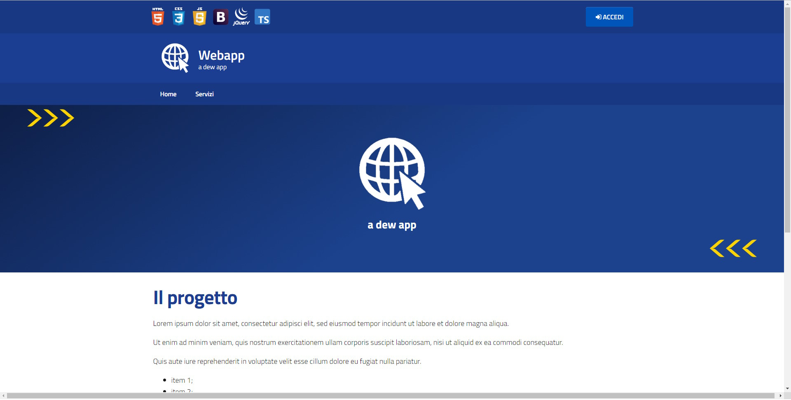
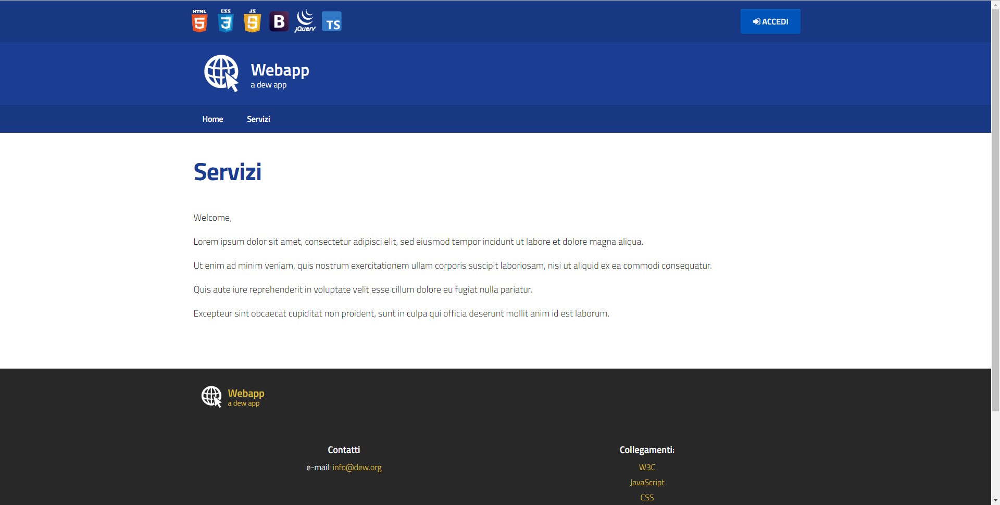
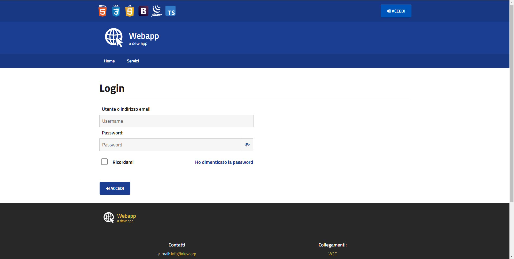
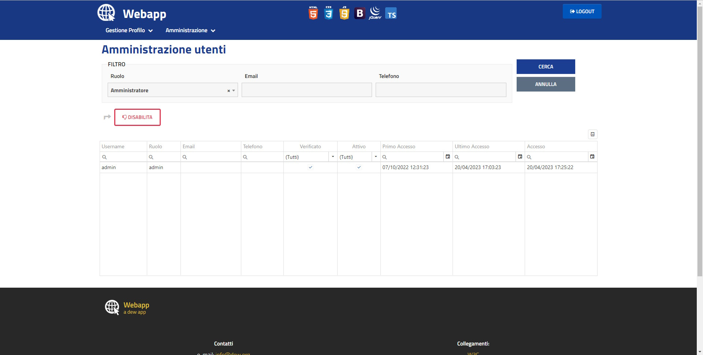

# Webapp Bootstrap Italia

Web application boilerplate based on a template of Bootstrap Italia.

## Dependencies

**multi-rpc 2.0.0**

- `git clone https://github.com/giosil/multi-rpc.git` 
- `mvn clean install` - this will publish `multi-rpc-2.0.0.jar` in Maven local repository

## Build and deploy web application

- `git clone https://github.com/giosil/webapp-bs-it.git` 
- `mvn clean install` - this will produce `webapp-bs-it.war` in `target` directory
- Create database (see `oracle`, `mysql` directories)
- Create datasource `jdbc/db_app` in your application server
- Deploy `webapp-bs-it.war` in your application server
- Launch `http://localhost:8080/webapp-bs-it` 

## Run

Launch http://localhost:8080/webapp-bs-it on browser.

**Home Page**

**Article**

**Login Page**

**Application**

## Contributors

* [Giorgio Silvestris](https://github.com/giosil)
